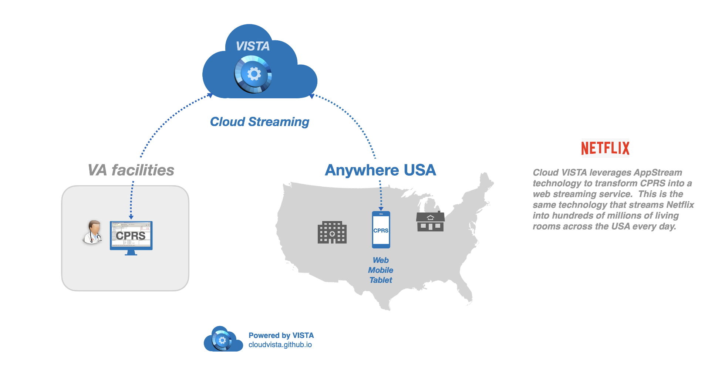

## App Stream Workflow

Streaming the CPRS application from the VA Enterprise Cloud as a web application enables secure access to CPRS anytime, anywhere on any secure web, mobile, tablet, or desktop computer. This application streaming technology uses the same encrypted cloud streaming technology that Netflix uses to stream movies to millions of viewers every day.

#### Pilot of App Streaming CPRS at Texas VA Medical Center
The cloud app streaming technology was piloted at Valley Coastal Bend TX VA Medical Center, and demonstrated that CPRS was not only securely accessible via a web browser on any PIV-secured device (web, mobile, or tablet), but that for certain workflows *CPRS was as much ten times faster*, improving efficiency of clinical staff and improving veteran access to care.

Presentation:
[CPRS Cloud Streaming-Texas VAMC](https://github.com/cloudvista/cprs-flows/blob/main/cloudstream/img/cloud-streaming-CPRS-2020.pdf)
