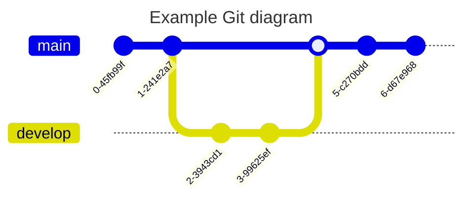

#### user journey


#### sequence diagram

**block diagram**  


#### quad chart





## Examples

**cprs login journey**

PROMPT:  
create user journey diagram in mermaid for the documentation provided for login to a client

USER:  
copy/paste CPRS user guide section on logging in

OUTPUT (ChatGPT):  
Based on the documentation provided, here's a detailed user journey diagram in Mermaid for logging into CPRS using both two-factor authentication with a PIV card and the alternative method with access and verify codes.  


**user journey**


**block diagram**  
https://mermaid.js.org/syntax/block.html#column-width-dynamics  


**flowchart**  


**graph**
```mermaid
graph TD;
    A[Outer Box] --> B[Inner Box 1];
    A --> C[Inner Box 2];

    B --> D[Sub Box 1];
    B --> E[Sub Box 2];

    D --> F[Sub Sub Box 1];
    D --> G[Sub Sub Box 2];

    C --> H[Sub Box 3];
    C --> I[Sub Box 4];

