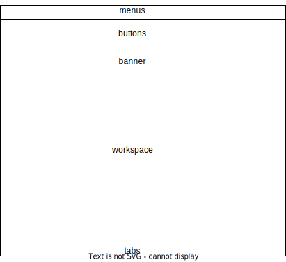

### SVG reference

inserted:   

html link  
,

### SVG code

<svg width="800" height="600" xmlns="http://www.w3.org/2000/svg">
  <!-- Navigation Bar -->
  <rect x="0" y="0" width="800" height="50" fill="#4CAF50"/>
  <text x="10" y="30" font-family="Verdana" font-size="20" fill="white">Navigation Bar</text>

  <!-- Sidebar -->
  <rect x="0" y="50" width="150" height="500" fill="#555"/>
  <text x="10" y="80" font-family="Verdana" font-size="15" fill="white">Sidebar Item 1</text>
  <text x="10" y="110" font-family="Verdana" font-size="15" fill="white">Sidebar Item 2</text>
  <text x="10" y="140" font-family="Verdana" font-size="15" fill="white">Sidebar Item 3</text>

  <!-- Header -->
  <rect x="150" y="50" width="650" height="100" fill="#2196F3"/>
  <text x="160" y="110" font-family="Verdana" font-size="25" fill="white">Header</text>

  <!-- Main Content Area -->
  <rect x="150" y="150" width="650" height="300" fill="#EEE"/>
  <text x="160" y="200" font-family="Verdana" font-size="20" fill="black">Main Content Area</text>
  
  <!-- Buttons -->
  <rect x="160" y="250" width="100" height="40" fill="#FF9800"/>
  <text x="170" y="275" font-family="Verdana" font-size="15" fill="white">Button 1</text>
  <rect x="280" y="250" width="100" height="40" fill="#FF9800"/>
  <text x="290" y="275" font-family="Verdana" font-size="15" fill="white">Button 2</text>

  <!-- Form -->
  <rect x="160" y="310" width="200" height="40" fill="white" stroke="black" stroke-width="1"/>
  <text x="170" y="335" font-family="Verdana" font-size="15" fill="gray">Input Field</text>
  <rect x="160" y="360" width="20" height="20" fill="white" stroke="black" stroke-width="1"/>
  <text x="190" y="375" font-family="Verdana" font-size="15" fill="black">Checkbox</text>

  <!-- Icons -->
  <circle cx="750" cy="70" r="10" fill="#FFC107"/>
  <circle cx="750" cy="100" r="10" fill="#FFC107"/>
  <circle cx="750" cy="130" r="10" fill="#FFC107"/>

  <!-- Images -->
  <rect x="450" y="250" width="200" height="100" fill="url(#image1)"/>
  <defs>
    <pattern id="image1" patternUnits="userSpaceOnUse" width="200" height="100">
      <image href="https://via.placeholder.com/200x100" x="0" y="0" width="200" height="100" />
    </pattern>
  </defs>

  <!-- Footer -->
  <rect x="0" y="550" width="800" height="50" fill="#4CAF50"/>
  <text x="10" y="580" font-family="Verdana" font-size="20" fill="white">Footer</text>
</svg>

