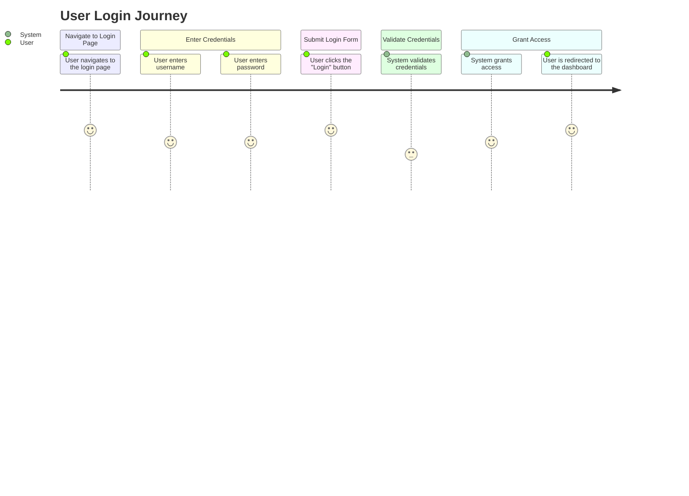
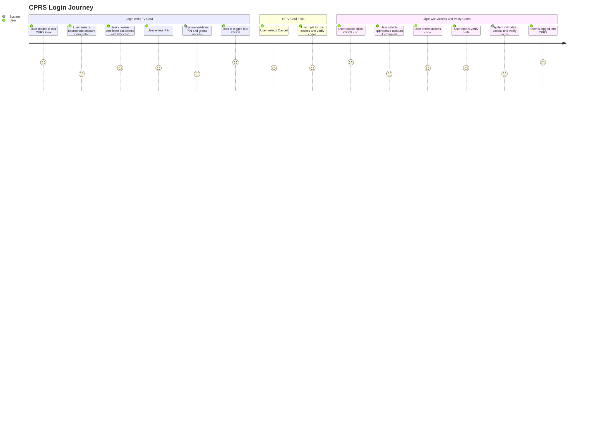

## Workflow as Code
Clinical workflow capture and representation in github flavored Markdown and Mermaid. 
This allows cloud-based collaboration, version control, and synchroniziation of all workflow descriptions in both text and graphical form,
full automation all graphics generation, and guaranteed 1:1 correspondence between text description and graphical representation.  

Workflow diagrams may be represented as:
* user journeys
* flowcharts
* block diagrams
* graphs

### Reference and Tutorials
[github diagrams](https://docs.github.com/en/get-started/writing-on-github/working-with-advanced-formatting/creating-diagrams)  
[mermaid live editor](https://mermaid.live)  
[mermaid-getting started](https://mermaid.js.org/intro/getting-started.html)  
[mermaid-timeline](https://mermaid.js.org/syntax/timeline.html)  


## Example 1
__Description of User Journey for logging in to CPRS__
```text
journey
    title User Login Journey
    section Navigate to Login Page
      User navigates to the login page: 5: User
    section Enter Credentials
      User enters username: 4: User
      User enters password: 4: User
    section Submit Login Form
      User clicks the "Login" button: 5: User
    section Validate Credentials
      System validates credentials: 3: System
    section Grant Access
      System grants access: 4: System
      User is redirected to the dashboard: 5: User
```

__Auto-generated Graphic__



## Example 2
__AI-generated workflow description and graphic__  
__AI PROMPT__
```text
create user journey diagram in mermaid using the documentation provided
[copy/pasted from CPRS user manual] for login to the CPRS client
```
__AI REPONSE__
```text
Based on the documentation provided, here's a detailed user journey diagram in Mermaid for logging into CPRS
using both two-factor authentication with a PIV card and the alternative method with access and verify codes.

journey
    title CPRS Login Journey
    section Login with PIV Card
      User double-clicks CPRS icon: 5: User
      User selects appropriate account if prompted: 3: User
      User chooses certificate associated with PIV card: 4: User
      User enters PIN: 4: User
      System validates PIN and grants access: 3: System
      User is logged into CPRS: 5: User
    section If PIV Card Fails
      User selects Cancel: 4: User
      User opts to use access and verify codes: 4: User
    section Login with Access and Verify Codes
      User double-clicks CPRS icon: 5: User
      User selects appropriate account if prompted: 3: User
      User enters access code: 4: User
      User enters verify code: 4: User
      System validates access and verify codes: 3: System
      User is logged into CPRS: 5: User
```

__Auto-generated graphic__

